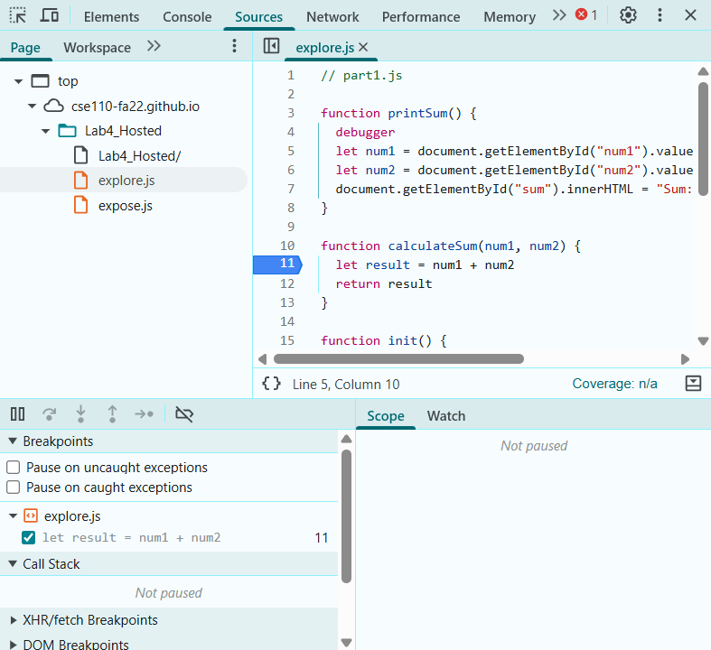

SS1. 

SS2. 

Q1. The bug was that when getting the numbers, they were considered strings, resulting in concatenation of 1 + 2 strings being 12.

Q2. I would fix it by first having a check to see if the string typecasted as a number is NaN or number, then if its true, I will type convert the num1 and num2 strings into numbers and then add them together. 

